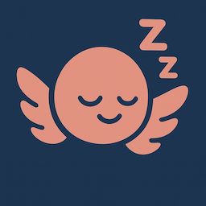

#  HYPNOS - AI Sleep Companion

A complete AI-powered sleep assistance system with voice chat, and local processing.


## 🏗️ Project Structure

```
HYPNOS/
├── 📱 hypnos_app/          # Flutter mobile app
├── 🖥️ server/              # Flask AI server  
├── 🔄 preprocessing/        # Data preparation tools
├── 📊 training/            # Model training notebooks
├── 📈 evaluation/          # Model evaluation
└── 📁 data/               # Training datasets
```

## ✨ Features

- 🎤 **Voice Chat** - Natural conversation with AI
- 🌙 **Sleep-Focused** - Insomnia-friendly design
- 🔒 **Privacy-First** - Local processing, no cloud data
- 📱 **Cross-Platform** - iOS and Android support
- ⚡ **Real-Time** - Fast response times

## 🚀 Quick Start

### 1. Start the AI Server
```bash
cd server
pip install -r requirements.txt
python server.py
```

### 2. Run the Mobile App
```bash
cd hypnos_app
flutter pub get
flutter run -d ios  # or android
```

## 🔧 Configuration

- **Server URL**: Edit `hypnos_app/lib/config/app_config.dart`
- **Model Paths**: Configure in `server/server.py`
- **Port**: Default 3001 (change in server)

## 📊 Components

- **Flutter App** - Modern mobile interface
- **Flask Server** - Local AI processing
- **GGUF Models** - Efficient local inference
- **Voice Processing** - Speech-to-text & TTS
- **Image Analysis** - Vision model integration

## 🛠️ Development

- **Frontend**: Flutter (Dart)
- **Backend**: Flask (Python)
- **AI Models**: GGUF format
- **Voice**: Speech recognition & synthesis
- **Storage**: Local device storage

## 📄 License

MIT License - see LICENSE file for details.

## 📚 References

If you use SleepQA data in your research or project, please cite:

- **SleepQA Dataset**: [GitHub Repository](https://github.com/IvaBojic/SleepQA)
- **SleepQA Paper**: [Proceedings of ML4H 2022](https://proceedings.mlr.press/v193/bojic22a.html)

If you use our code, please cite this repository:

```bibtex
@misc{hypnos2024,
  title={HYPNOS: AI Sleep Companion},
  author={Dmitry Kazhdan, Maria Chepurina},
  year={2025},
  url={https://github.com/dmitrykazhdan/HYPNOS}
}
```

---

**HYPNOS** - Helping you sleep better with AI 🌙✨

